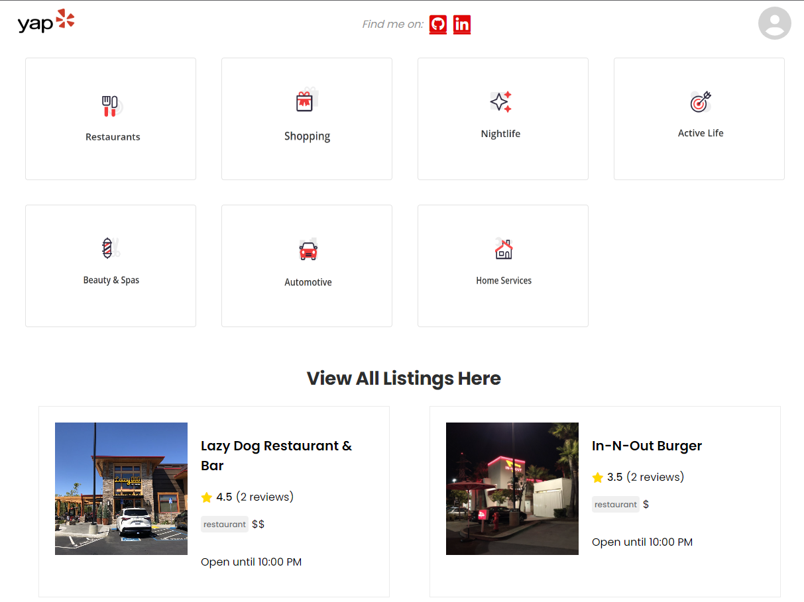

# Yap
Yap is a partial clone of the website 'Yelp', a popular online platform and mobile app that connects users with local businesses, primarily focusing on restaurants, bars, and various other services. I love the layout of the site as it is simple yet functional. It is easy to navigate and it's intuitive.The site has some impressive CSS features and google maps. Hopefully I can implement some of these extras. Two weeks can be a tight deadline... Moving past the deadline of the capstone project, I hope to make this clone really standout as the jewel of my resume!

# Live Link

 https://yap.onrender.com
## Frameworks, Languages, Libraries

## Database

## Hosting

## Wiki Link

- [Database Schema]
- [Features]
- [EndPoints]
- [Redux Store Shape]

# Landing Page

# Feature List
- Listings
- Reviews
- Users(partial)

# Future Implementation Goals#
- Items List
- User  full CRUD
- Search Bar
- Google API

# Connect

https://www.linkedin.com/in/zak-alashqar/

[Database Schema]: https://github.com/EhabZak/Yap/wiki/Database-Schema
[Features]: https://github.com/EhabZak/Yap/wiki/Feature-List
[Redux Store Shape]: https://github.com/EhabZak/Yap/wiki/Redux-Store-Shape
[EndPoints]: https://github.com/EhabZak/Yap/wiki/Backend-API-Routes
